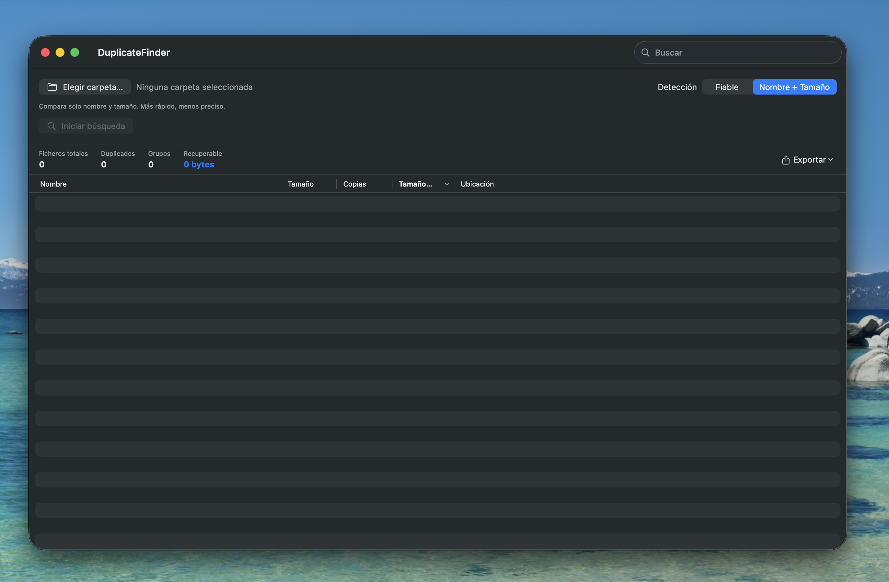
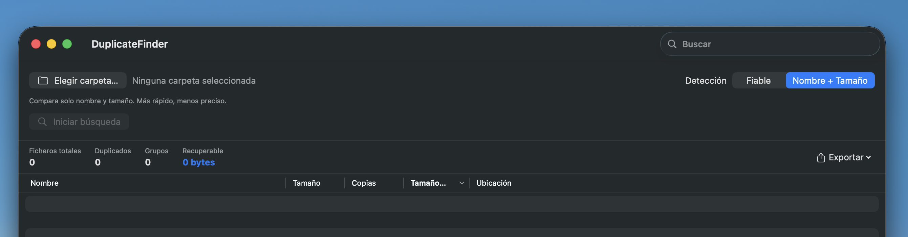
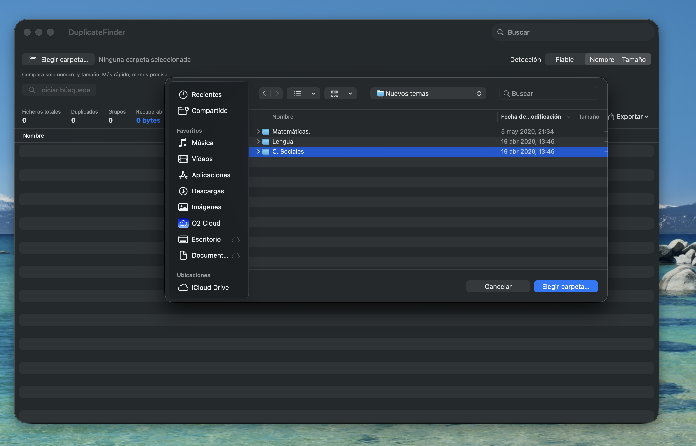
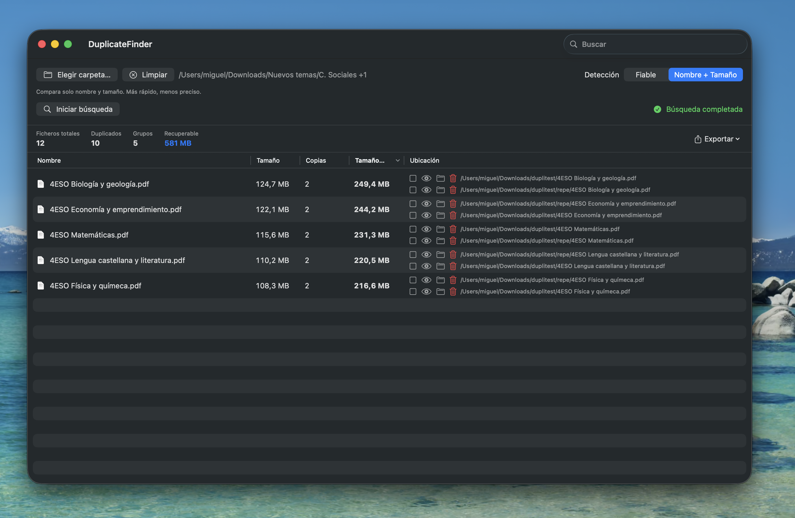

# User Manual — DuplicateFinder

> 
> *Main view of DuplicateFinder with the scan bar and results table.*

---

## Table of Contents

1. [Introduction](#1-introduction)
2. [System Requirements](#2-system-requirements)
3. [Main Interface](#3-main-interface)
4. [Selecting Folders](#4-selecting-folders)
5. [Detection Modes](#5-detection-modes)
6. [Scan Progress](#6-scan-progress)
7. [Results](#7-results)
8. [File Actions](#8-file-actions)
9. [Exporting Results](#9-exporting-results)
10. [Preferences](#10-preferences)
11. [Tips and Best Practices](#11-tips-and-best-practices)

---

## 1. Introduction

**DuplicateFinder** is a macOS application that finds and manages duplicate files on your disk. It scans one or more folders, computes a SHA-256 fingerprint for each file, and groups identical ones together, letting you review, open, delete, or export a report.

### Key Features

- Recursive scanning of multiple folders simultaneously.
- Two detection modes: **Reliable** (content-based, SHA-256) and **Quick** (name + size).
- Filters by size, extensions, and excluded folders.
- Sortable table with search in results.
- Individual and batch actions: open, reveal in Finder, move to Trash, or permanently delete.
- Export to CSV and JSON with every duplicate file location.
- Interface localized into 8 languages.

---

## 2. System Requirements

- **macOS** 14.0 (Sonora) or later.
- **Apple Silicon** or **Intel**.
- No external packages or dependencies required.

---

## 3. Main Interface

The window is divided into three areas:

| Area | Description |
|------|-------------|
| **Top bar (ScanView)** | Folder selection, detection mode picker, start/cancel controls. |
| **Statistics bar** | Global metrics (total files, duplicates, groups, reclaimable space) and export button. |
| **Results table** | Sortable list of duplicate groups with search. |

---

## 4. Selecting Folders

1. Click the **"Choose Folder…"** button (folder icon).
2. The standard macOS dialog opens. Select **one or multiple folders** by holding ⌘ (Command).
3. Folders **accumulate** in the list. You can add more folders in subsequent selections.
4. To clear the selection, click the **"Clear"** button (✕ icon) that appears next to it.

> The **"Start Scan"** button stays disabled until at least one folder is selected. You can also drag a folder from Finder directly onto the window.

---

## 5. Detection Modes

DuplicateFinder offers two modes, selectable via a segmented control in the top bar:

| Mode | Description |
|------|-------------|
| **Reliable** | Computes the SHA-256 hash of each file's **full content**. Guarantees no false positives, but is slower because it reads every file. |
| **Name + Size** | Compares only the name (case-insensitive) and size in bytes. Very fast (no file reading), but may produce false positives if different files share the same name and size. |

> The default mode is set in **Preferences → Detection**.

---

## 6. Scan Progress

During a scan, the top bar shows the current phase:

| Phase | Indicator |
|-------|-----------|
| **Scanning…** | Counter of files processed in the folder. |
| **Comparing…** | Progress bar with number of hashes computed out of total candidates. |
| **Computing…** | Progress of database insertion and aggregate calculation. |
| **Complete** | Green checkmark icon. |
| **Cancelled** | Orange icon. |

You can cancel the scan at any time by clicking the **"Cancel"** button.

---

## 7. Results

Once the scan finishes, the results table appears with the following columns:

| Column | Description |
|--------|-------------|
| **Name** | File name with its icon. |
| **Size** | Size of each copy. |
| **Copies** | Number of duplicates for this file. |
| **Size × Copies** | Total space occupied by all copies. |
| **Location** | Full path of each copy, with action buttons. |

You can **sort** the table by clicking any column header. You can also **search** files by name or path using the search field at the bottom.

### Statistics bar

Four metrics are shown above the results:

- **Total files**: all scanned files.
- **Duplicates**: files belonging to a duplicate group.
- **Groups**: sets of identical files.
- **Reclaimable**: space freed if all duplicate copies (minus one per group) are removed.

---

## 8. File Actions

Each duplicate file in the "Location" column has action buttons:

| Button | Action |
|--------|--------|
| 👁 (Eye) | Open the file with the default application. |
| 📁 (Folder) | Reveal the file in Finder. |
| 🗑 (Trash) | Move to Trash (or permanently delete, depending on preferences). |

### Batch deletion

You can select multiple files by checking the square box next to each one:

1. Check the files you want to delete.
2. The **"Delete selected (N)"** button appears in the statistics bar.
3. Click it to confirm and complete the deletion.

> You can change the deletion behavior in **Preferences → General**: toggle "Move files to Trash".

---

## 9. Exporting Results

Click the **"Export"** button (share icon) in the statistics bar and choose:

- **CSV** — Comma-separated text file, compatible with Excel, Numbers, and spreadsheets.
- **JSON** — Structured format, ideal for programmatic processing.

Both formats include **every copy of each duplicate file** (not just one per group), with the fields: name, path, size, number of copies, total occupied space, and SHA-256 hash.

An `NSSavePanel` dialog opens to choose the destination and filename.

---

## 10. Preferences

Press `⌘,` (Command + ,) to open preferences, organized into four tabs.

### General

| Option | Description |
|--------|-------------|
| **Top N results** | Maximum number of rows in the results table (10–100,000). |
| **Move to Trash** | When on, files are sent to Trash instead of being permanently deleted. |
| **Keep strategy** | Strategy for automatically selecting which copy to keep (oldest, newest, or shortest path). |
| **Appearance** | Light, dark, or system appearance mode. |

### Detection

| Option | Description |
|--------|-------------|
| **Default mode** | Detection mode selected when opening the app. |

### Filters

| Option | Description |
|--------|-------------|
| **Min / Max size** | Size range in bytes. Files outside this range are ignored. |
| **Include hidden** | Include hidden files and folders (starting with `.`). |
| **Follow symlinks** | When on, symbolic links are followed during scanning. |
| **Allowed extensions** | Comma-separated list (e.g. `jpg, png, mp4`). Empty = all extensions. |
| **Excluded folders** | Comma-separated list of folder names skipped during scanning (e.g. `node_modules, .git`). |

### Language

Switch the interface language among the 8 available. The app may need to restart for the change to fully apply.

---

## 11. Tips and Best Practices

1. **Start with Quick mode** if you have many folders. It's much faster and may find most duplicates.
2. **Use Reliable mode for final decisions** before deleting — especially when file names don't match — to avoid false positives.
3. **Pick specific folders**, not your entire disk. Scanning only Downloads, Documents, and Desktop drastically reduces time and noise.
4. **Review locations** in the "Location" column before deleting. A duplicate might live in a system folder where it should stay.
5. **Export a CSV** before cleaning up to keep a record of deleted files.
6. **Set up filters** when looking for specific file types (e.g., only `.jpg` and `.png` images).
7. **Use the "Clear" button** to start fresh with a new folder selection without quitting the app.

---

> **DuplicateFinder** — [mdc](https://github.com/migueldc-oss/DuplicateFinder)
>
> Documentation generated July 1, 2026.
